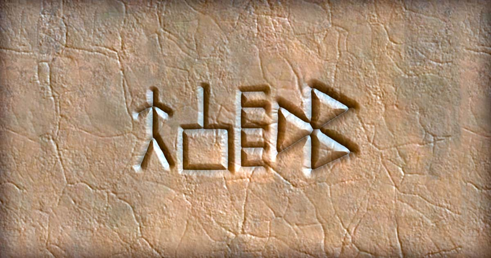

# Indus Seal Generator
Generate your own earthy seal, similar to the ones found in Indus Valley Civilization, in it's enigmatic script. This project is inspired by and based on YajnaDevam's [work](https://indusscript.net/) of decipherment by crypto analysis.

## 🔗 Try it!
* [Live Demo](https://shiben.tech/indus-seal-generator/)
* [Android App](https://play.google.com/store/apps/details?id=tech.shiben.isg)

## 🛠️ How to Run
* Clone the repository
* Download js dependencies: Go inside `depends` and run `download.sh`
* Run a localhost server at project root: `python3 -m http.server`
* Open the link in your browser

## 🧠 How it Works?
* The user input is first converted into a single unifying script called IAST. This text is then mapped to a series of glyph Ids, which are placed and composited on a WebGL canvas. The glyph designs (originally in SVG) are pre-processed in a special "SDF" format which allows the fragment shader to render them with lighting and material effects.

## ✨ Credits
* Created by [Shiben Bhattacharjee](https://shiben.tech/). Currently building [Kapih Game](https://kapih.game/) at [88 Games](https://88games.in/)
